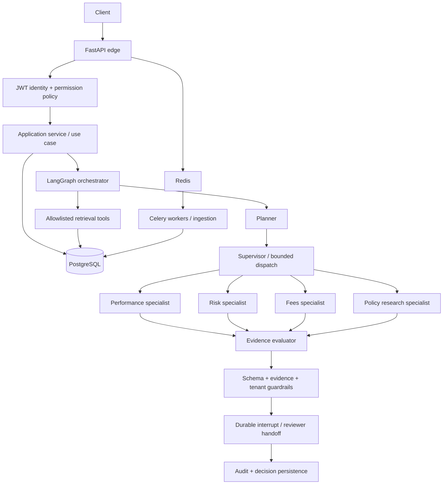

# Financial Compliance Review Platform — Staff/Principal Engineering Edition

A portfolio-grade **reference implementation** for policy-grounded financial-compliance review.
It demonstrates an explicit multi-agent workflow, durable human-in-the-loop (HITL), PostgreSQL +
pgvector retrieval, tenant-aware persistence, RBAC, guardrails, auditability, background ingestion,
and operational design.

## Architecture at a glance



## Design patterns
- **Hexagonal architecture / ports & adapters:** interfaces isolate application logic from SQLAlchemy,
  model providers, and retrieval implementations.
- **Repository:** persistence queries are centralized and tenant-scoped.
- **Unit of Work:** transaction boundaries are explicit; do not hold a DB transaction open while
  waiting for a model or human.
- **Strategy:** vector, keyword, and fallback retrieval are swappable.
- **Factory:** graph and runtime construction are centralized.
- **Command:** review creation and reviewer decisions are validated commands.
- **Supervisor / specialist handoff:** the supervisor dispatches bounded tasks to narrowly scoped
  agents; the graph owns routing, retries, and terminal states.
- **Policy-as-code:** permissions and state transitions are deterministic code, never model output.

## HITL lifecycle
1. Create review and commit it.
2. Run retrieval → planning → specialist work → evaluation → guardrails.
3. LangGraph `interrupt()` pauses with a reviewer packet; PostgreSQL checkpoint preserves state.
4. Reviewer endpoint verifies tenant, permission, review status, and separation-of-duties.
5. Resume the same `thread_id` with a constrained decision command.
6. Persist outcome and append an audit event.

**Important:** never expose an endpoint that resumes arbitrary graph threads. Resolve the review by
tenant first, authorize the reviewer, then resume the exact server-derived thread ID.

## Local development
```bash
cp .env.example .env
docker compose up --build -d
docker compose exec api alembic upgrade head
docker compose exec api pytest
```
The compose stack is for local development. Production needs managed PostgreSQL/Redis, OIDC/JWKS,
secret management, TLS, network policies, backups/PITR, telemetry, and load/security testing.

## What “enterprise-ready” means here
This is a **serious reference scaffold**, not a claim of certified production readiness. The package
includes core architectural patterns and implementation seams; before real financial data is used,
complete the checklist in `docs/PRODUCTION_READINESS.md`, run integration tests against real services,
and get security/compliance sign-off. In particular, validate LangGraph checkpoint compatibility
with your pinned versions, run RLS tests under a non-owner DB role, and implement your organisation's
identity provider and data-retention rules.
