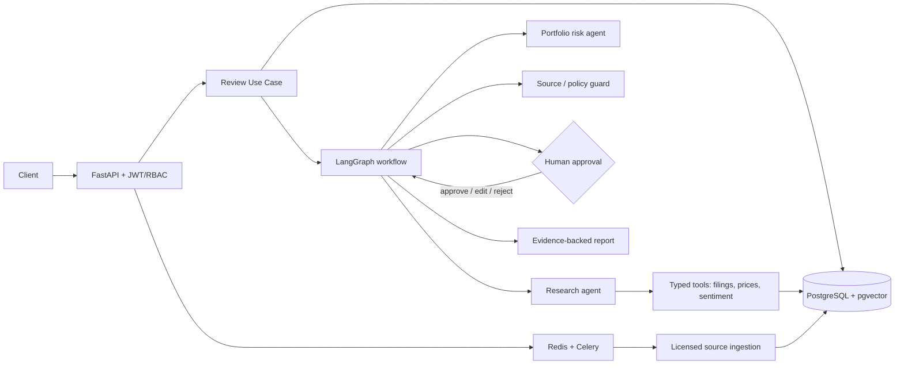

# Investment Strategy & Market Intelligence Platform
**Senior/Staff AI Engineering reference implementation** — market research, digital-asset portfolio analytics, source-grounded analysis, and human-reviewed investment research workflows.

> This is an engineering reference scaffold, not investment advice and not a production-certified financial system. It does not execute trades, promise returns, or treat scraped sentiment as fact. Connect only to data sources you are licensed to use. All investment-facing outputs require review.

## Architecture at a glance



## Key design decisions
- **Hexagonal architecture**: HTTP, database, LLM, market-data, and queue adapters are replaceable ports/adapters.
- **Workflow as a state machine**: LangGraph nodes have explicit inputs/outputs, bounded retries, review interrupts, and checkpointable state.
- **Human-in-the-loop (HITL)**: no recommendation is published without a reviewer decision; review actions are authorized and audited.
- **Evidence-first RAG**: retrieved documents carry source, timestamp, tenant, and content hash; answers must cite evidence IDs.
- **Tenant isolation**: tenant ID comes from authenticated claims, never request JSON. DB queries are tenant-scoped; PostgreSQL RLS is included as defense in depth.
- **Safe tools**: agents receive typed, allow-listed tools. No arbitrary URL fetch, shell, SQL, or trade-execution tool.
- **Financial guardrails**: no guaranteed-return language, no personalized buy/sell instruction, freshness checks, uncertainty disclosure, citations, and human approval.
- **Market-data provenance**: every price/metric records provider, observed-at time, currency, and methodology.
- **Operational controls**: idempotency key, request correlation, rate-limit seam, structured errors, health checks, audit events, and background ingestion.

## Quick start

1. Copy `.env.example` to `.env` and set secrets.
2. Start infrastructure:
   ```bash
   docker compose up -d postgres redis
   ```
3. Install:
   ```bash
   python -m venv .venv && source .venv/bin/activate
   pip install -e ".[dev]"
   ```
4. Apply schema:
   ```bash
   alembic upgrade head
   ```
5. Run API:
   ```bash
   uvicorn app.main:app --reload
   ```
6. Run tests:
   ```bash
   pytest
   ```

The included provider adapters are intentionally safe stubs. Implement a licensed market-data provider and a model provider behind the ports before enabling live research. `MOCK_MODE=true` uses deterministic local fixtures.

## Example request

`POST /v1/reviews`

```json
{
  "question": "Summarize recent volatility drivers for BTC and compare them with a diversified digital-asset risk framework.",
  "scope": {"assets": ["BTC"], "lookback_days": 30},
  "purpose": "research"
}
```

Response returns a review ID and status. Retrieve via `GET /v1/reviews/{review_id}`. Reviewer endpoints are under `/v1/reviews/{review_id}/decision`.

## Important production hardening before deployment
- Replace dev JWT secret and configure OIDC/JWKS rotation.
- Configure TLS, secrets manager, private networking, backups, PITR, encryption, and key rotation.
- Implement provider-specific entitlements, licensing, and rate limits.
- Run migrations and integration tests against actual PostgreSQL/pgvector, Redis, Celery, and a durable LangGraph checkpointer.
- Add independent model validation, red-team testing, security review, model/vendor risk approval, and compliance sign-off.
- Define retention/deletion, data residency, incident response, and audit immutability.
- Do not use the demo in live trading or client advice.

## Repository map
See `docs/architecture.md`, `docs/security.md`, `docs/runbooks.md`, and `docs/interview_narrative.md`.
